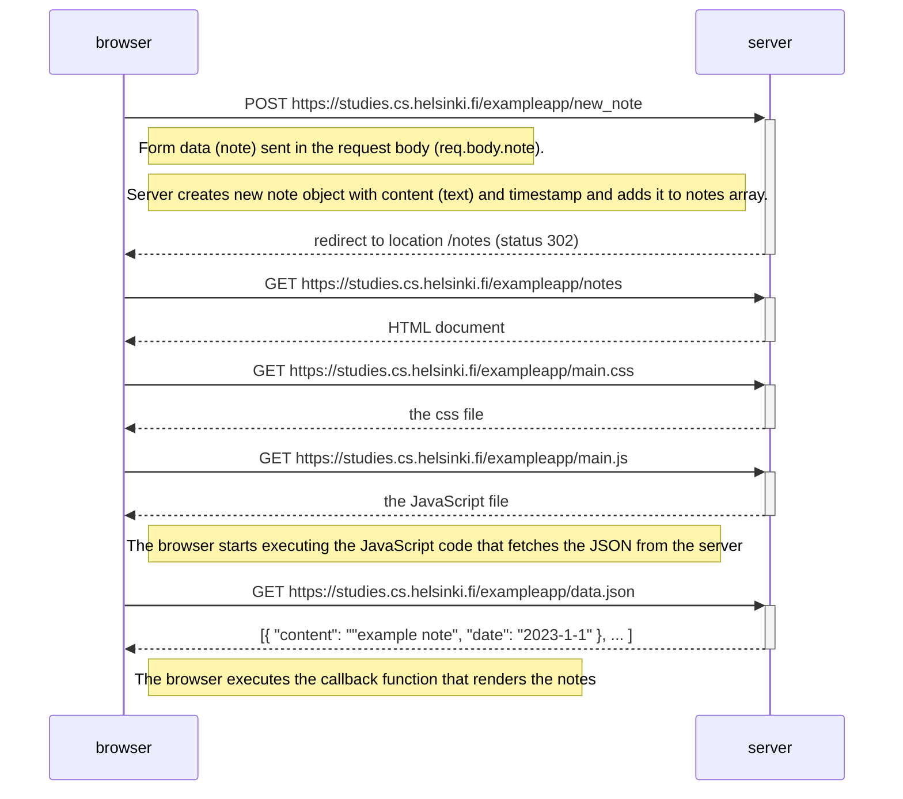

```mermaid
sequenceDiagram
participant browser
participant server

    browser->>+server: POST https://studies.cs.helsinki.fi/exampleapp/new_note

    Note right of browser: Form data (note) sent in the request body (req.body.note).

    Note left of server: Server creates new note object with content (text) and timestamp and adds it to notes array.

    server-->>-browser: redirect to location /notes (status 302)

    browser->>+server: GET https://studies.cs.helsinki.fi/exampleapp/notes

    server-->>-browser: HTML document

    browser->>+server: GET https://studies.cs.helsinki.fi/exampleapp/main.css

    server-->>-browser: the css file

    browser->>+server: GET https://studies.cs.helsinki.fi/exampleapp/main.js

    server-->>-browser: the JavaScript file

    Note right of browser: The browser starts executing the JavaScript code that fetches the JSON from the server

    browser->>+server: GET https://studies.cs.helsinki.fi/exampleapp/data.json

    server-->>-browser: [{ "content": ""example note", "date": "2023-1-1" }, ... ]

    Note right of browser: The browser executes the callback function that renders the notes
```
