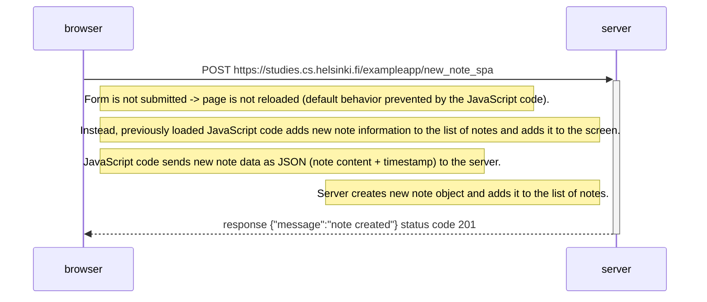

```mermaid
sequenceDiagram
participant browser
participant server

    browser->>+server: POST https://studies.cs.helsinki.fi/exampleapp/new_note_spa

    Note right of browser: Form is not submitted -> page is not reloaded (default behavior prevented by the JavaScript code).

    Note right of browser: Instead, previously loaded JavaScript code adds new note information to the list of notes and adds it to the screen.

    Note right of browser: JavaScript code sends new note data as JSON (note content + timestamp) to the server.

    Note left of server: Server creates new note object and adds it to the list of notes.

    server-->>-browser: response {"message":"note created"} status code 201


```
